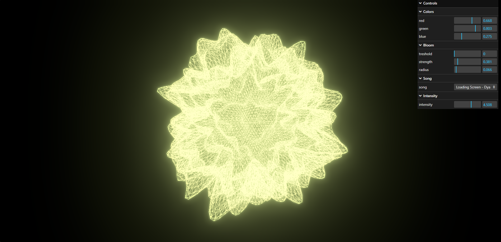

## 3D-Laboratory
A simple website I built to display my three.js projects. Feel free to [check it out](https://docas95.github.io/3D-Laboratory/).

## Repository Structure

It's pretty simple: inside the "projects" folder there is a folder for each project.

## Projects

### [3D Audio Visualizer](https://docas95.github.io/3D-Laboratory/projects/3D-Audio-Visualizer/)

Using perlin noise to visualize audio frequency on an icosahedron.

